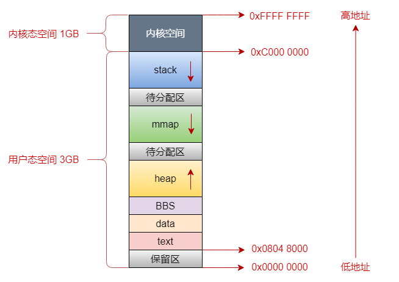
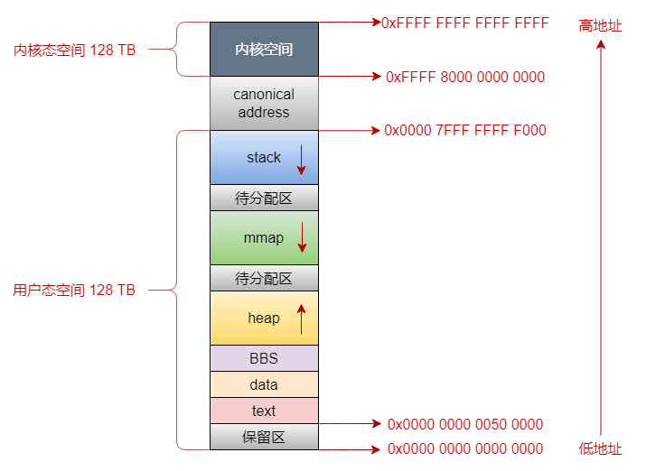

# 理解glibc malloc()原理

现在开源社区中存在很多种内存分配器，如`dlmalloc,ptmalloc2,jemalloc,tcmalloc,libumem`等。在本文中仅讨论`glibc malloc`使用的内存分配器`ptmalloc2`。

在早期`Linux`里，使用`dlmalloc`做为默认的内存分配器。而`ptmalloc2`来自于`dlmalloc`的分支，并在其基础上添加了线程支持，成为了现代`Linux`默认的内存分配器集成到`glibc`中。

## 内存布局

在32位和64位操作系统中，内存布局是不同的。在描述详细的内存布局前，先了解几个基本概念：
- 栈区（stack）： 存储程序执行期间的局部变量和函数参数，从高地址向低地址增长。
- 文件映射区（mmap）： 将文件或对象映射到进程的地址空间，动态链接库加载到此处。
- 堆区（heap）： 动态内存分配区，通过`malloc,free`等方式管理。
- 未初始化变量区（BSS）： 存储未被初始化的全局变量和静态变量。
- 数据区（data）： 存储有预定义的得全局变量和静态变量。
- 代码区（text）： 存储只读的程序代码段和机器指令。

### 32位机器上内存空间分布

#### 经典布局

在32位操作系统中，指针的寻址范围是$2^{32}$，所表达的虚拟内存空间为 4 GB。

其中，内核态虚拟内存空间为 1 GB，用户态虚拟内存空间为 3 GB。其具体内存布局如下图：

其中，`0x0000 0000`到`0x0804 8000`这段虚拟内存地址是不可访问的保留区，被大多数操作系统认为不是一个合法的地址，不允许访问。

保留区上边就是`text`和`data`段，它们是从程序的二进制文件中直接加载到内存中的。`BSS`中的数据也存在二进制文件中，而因为它们是没有初值的，所以只会记录大小，加载进内存时生成一段 0 填充。

再上边就是`heap`空间，红色箭头表示其空间地址的增长方向是从低地址到高地址的。内核中，使用`start_brk`标识`heap`的起始位置，`brk`表示结束位置。当申请新的内存空间时，只需要将`brk`指针增加对应的大小，回收时减少对应的大小即可。

接下来就是`mmap`空间，它是从高地址向低地址增长的。进程运行时所依赖的动态链接库中的`text,data,BBS`段就加载在此处；另外映射的地址空间也保存在这个空间。

然后就是`stack`空间，它是从高地址向低地址增长的。内核中使用`start_stack`标识`stack`的起始位置，`RSP`寄存器中保存栈顶指针，`RBP`寄存器中保存栈基地址。通常情况下，Linux系统的`stack size`被限制在 8192 KB，可以通过`ulimit -a`查看，`ulimit -s`修改。

最后就是内核空间了。用户进程不允许直接访问内核空间。

观察`heap`和`nnmap`增长方向，会发现它们是相对增长。这意味着它们可增长的虚拟内存空间会互相影响，而32位操作系统能提供的虚拟空间地址是有限的，所以内核引入了另外一种内存布局。但对于64位操作系统，因为其提供了足够大的虚拟内存空间，所以往往采用此种布局。

#### 默认布局

为了解决上述内存布局的空间局限性，引入了如下内存布局：

可以看到，这种内存布局，通过修改`nnmap`为向上增长的方式，增大了`nnmap`和`heap`的可用虚拟内存地址空间。

### 64位机器上内存空间分布

在64位操作系统中，指针的寻址范围是$2^{64}$，所表达的虚拟内存空间为 16 EB。实际情况中根本不会用到这么大范围的内存空间，所以目前64位操作系统只使用了48位来描述虚拟内存空间，寻址范围为$2^{48}$，所表达的虚拟空间内存为 256 TB。

其内存布局如下：

其中，`canonical address`为空洞区域，是不可访问的内存空间。

另外，观察内核空间和用户空间，可以发现，内核空间的高16位全部位0，而用户空间的高16位全部位1。以此可以快速判断一个虚拟地址空间属于用户空间还是内核空间，反之，则是处于空洞区域中，肯定是非法访问了。

实际上，在`text`和`data`之间，还有一段不可读写的保护段，用于防止程序在读写时越界访问到代码段。访问该保护段会直接引起`SIGSEGV`信号中断，防止程序继续向下执行。

## 内存分配

根据上文所述，`heap`和`mmap`区域是可以供用户程序使用的虚拟内存空间，操作系统提供了相应的系统调用来完成分配内存的工作。
- heap： 系统提供`brk()`函数，`C`提供`sbrk()`库函数。
- mmap： 系统提供`mmap()`和`munmap()`函数。

实际上，`glibc malloc()`并不是系统调用，而是进行了二次封装。其本质就是通过`brk()`和`mmap()`两种系统调用方式，以完成分配内存的。

这里有一个很重要的概念**内存的延迟分配**。这是Linux内存管理的基本思想。申请内存时只分配虚拟内存，而不会分配实际物理内存。只有当用户真正访问这块内存区域时，内核才会分配具体的物理页面给用户。内核释放内存时也是通过虚拟内存找到其映射的物理页面，将其全部释放。
